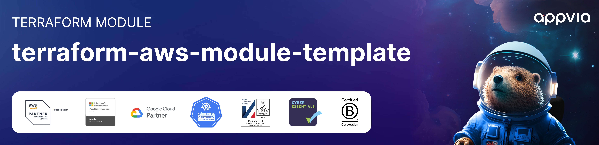

<!-- markdownlint-disable -->

<a href="https://www.appvia.io/"></a><br/><p align="right"> </a> <a href="https://github.com/appvia/terraform-aws-module-template/releases/latest"></a> <a href="https://appvia-community.slack.com/join/shared_invite/zt-1s7i7xy85-T155drryqU56emm09ojMVA#/shared-invite/email"></a> <a href="https://github.com/appvia/terraform-aws-module-template/graphs/contributors"></a>

<!-- markdownlint-restore -->
<!--
  ***** CAUTION: DO NOT EDIT ABOVE THIS LINE ******
-->


# Terraform AWS RAM (Resource Access Manager)

## Description

The purpose of this module is to provide a building block for using AWS RAM (Resource Access Manager) to share (supported) AWS Resources across multiple accounts .

## Usage

Add example usage here

```hcl
module "ram" {
  source  = "appvia/ram/aws"
  version = "0.0.1"

  # insert variables here
}
```

## Update Documentation

The `terraform-docs` utility is used to generate this README. Follow the below steps to update:

1. Make changes to the `.terraform-docs.yml` file
2. Fetch the `terraform-docs` binary (https://terraform-docs.io/user-guide/installation/)
3. Run `terraform-docs markdown table --output-file ${PWD}/README.md --output-mode inject .`

<!-- BEGIN_TF_DOCS -->
## Providers

| Name | Version |
|------|---------|
| <a name="provider_aws"></a> [aws](#provider\_aws) | >= 5.0.0 |

## Inputs

| Name | Description | Type | Default | Required |
|------|-------------|------|---------|:--------:|
| <a name="input_name"></a> [name](#input\_name) | The name of the resource share. | `string` | n/a | yes |
| <a name="input_principals"></a> [principals](#input\_principals) | The principal to associate with the resource share. Possible values are an AWS account ID, an AWS Organizations Organization ARN, or an AWS Organizations Organization Unit ARN | `list(string)` | n/a | yes |
| <a name="input_resource_arns"></a> [resource\_arns](#input\_resource\_arns) | The Amazon Resource Name (ARN) of the resource share. | `list(string)` | n/a | yes |
| <a name="input_allow_external_principals"></a> [allow\_external\_principals](#input\_allow\_external\_principals) | Indicates whether principals outside your organization can be associated with a resource share. | `bool` | `true` | no |
| <a name="input_permission_arns"></a> [permission\_arns](#input\_permission\_arns) | Specifies the Amazon Resource Names (ARNs) of the RAM permission to associate with the resource share. If you do not specify an ARN for the permission, RAM automatically attaches the default version of the permission for each resource type. You can associate only one permission with each resource type included in the resource share. | `list(string)` | `[]` | no |
| <a name="input_tags"></a> [tags](#input\_tags) | Tags map for aws\_ram\_resource\_share resource | `map(string)` | `{}` | no |

## Outputs

| Name | Description |
|------|-------------|
| <a name="output_principal_association_arns"></a> [principal\_association\_arns](#output\_principal\_association\_arns) | The ARNs of the principal associations |
| <a name="output_resource_association_arns"></a> [resource\_association\_arns](#output\_resource\_association\_arns) | The ARNs of the resource associations |
| <a name="output_resource_share_arn"></a> [resource\_share\_arn](#output\_resource\_share\_arn) | The ARN of the created resource share |
<!-- END_TF_DOCS -->
